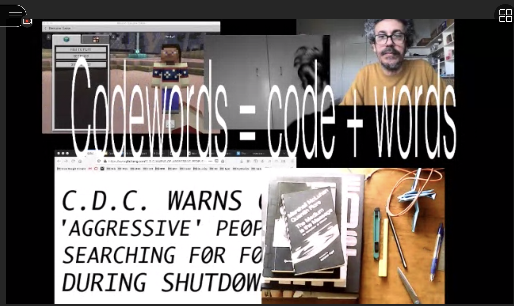

# Week 01

## INTRODUCTIONS

The first week consisted of Andy and Karen introducing the studio to us and running us through the different assignments.  
It was really cool to see the multi-screen Collaberative Ultra setup they had made, I think in a way this was an introduction to the kind of work we would be doing in this studio.

## MINECRAFT MELBOURNE

After the introductions the whole class met inside of Minecraft in a server that was designed to replicate Melbourne's CBD.
This was quite a strange experience for me, having a classroom run inside of a video game really got me thinking about the future of teaching and the formats and platforms for online education. The idea of humans living completely online scares me. I can't help but think of the Bruce Willis movie [Surrogates](https://en.wikipedia.org/wiki/Surrogates).

## MACHINIMA

Next we were introduced to the first assignment, Re-readings. 
Andy and Karen showed us the book [House of Leaves](https://en.wikipedia.org/wiki/House_of_Leaves) which the first assignment would be based around.

We also looked at a few different examples of people using video games as storytelling or performance tools.

[The Pookah, 2008](https://www.youtube.com/watch?v=Tn9wVdaMOlw)                 |  [Quake Friends, 2002](https://www.youtube.com/watch?v=dmyO1A5J8SU)
:-------------------------:|:-------------------------:
       |   

## READING
Andy asked everyone if they were reading a book at the moment. I might try to document what i'm reading throughout the semester and what books i'm looking at, I think this would be interesting to be able to look back on. I'm currently reading A * New * Program for Graphic Design by David Reinfurt.

[NEXT](https://github.com/HamishPayne/CODE-WORDS/edit/master/Classroom/Week-02)
 
