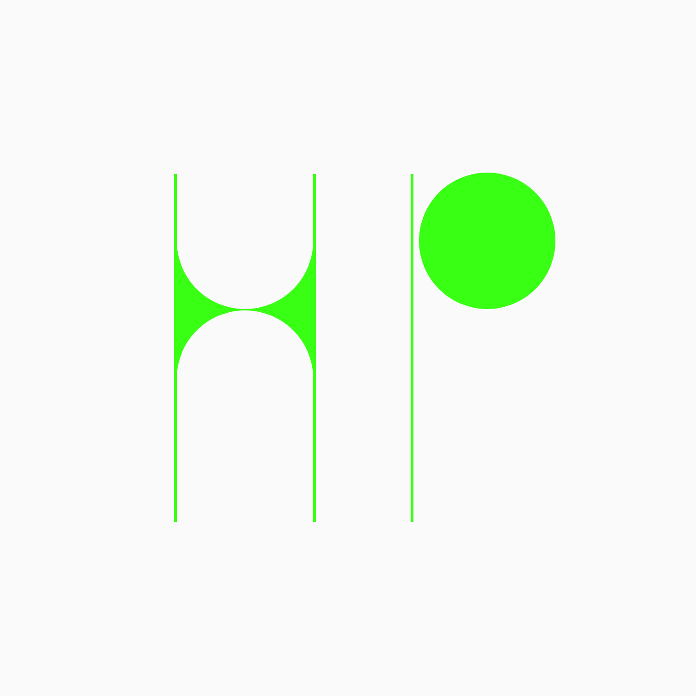
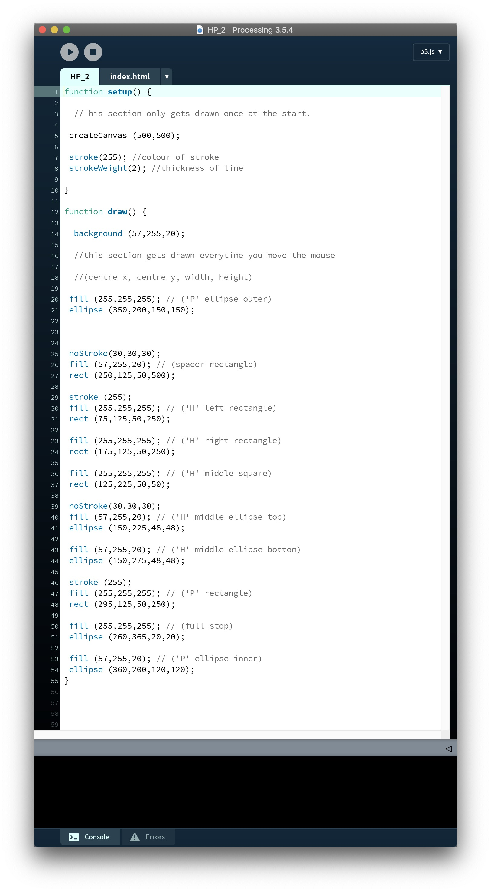
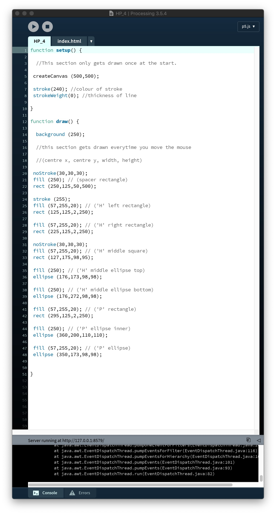
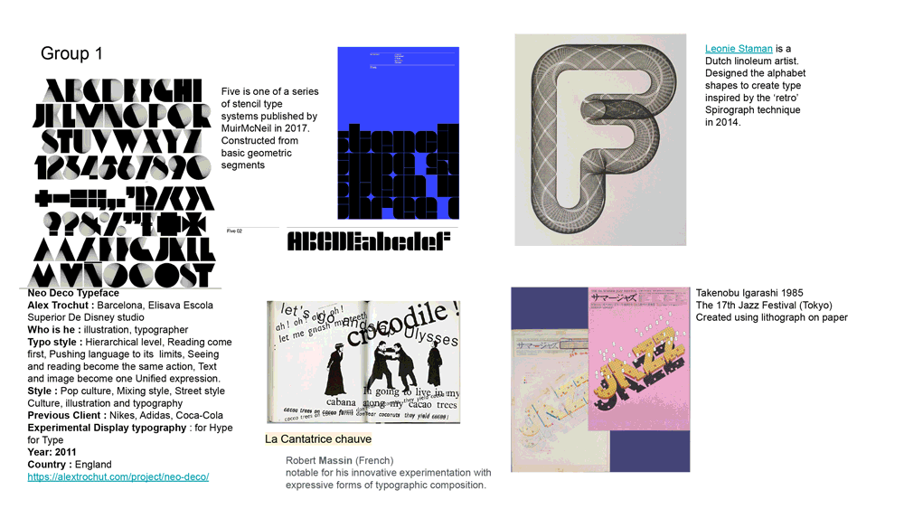

# Week 02

## Initials
        
   a  |  b
:-------------------------:|:-------------------------:
       |   
       |   

this week we presented our initials that we designed and coded in processing.
It was really interesting to see how everyone had approached this, we all only had a very basic understanding of the program so were farily limited to what we had learnt in week one, this made it even more interesting to see what people had come up with using just basic shapes.
I found Processing fairly easy to understand as I had learnt HTML at the start of uni so I had a general idea of how coding worked, but i found p5js a lot easier than HTML, It just seemed to make more sense to me. After doing these HP experiments i'm really excited for the main project, I'm really keen to explore Processing further and see what's possible.

I've always enjoyed designing within a set of paramaters as it encourages me to think creatively so I think I'm really going to enjoy designing with code.

## Modular Typefaces

We also looked at modular typefaces this week.
I think modular typefaces and coding are very similar in the way that they both work within a set of limitations and follow a set of rules. A modular typeface must be made up from the same forms to concidered modular. I also like the way that most modular typefaces can by physically constructed and I imagine a lot of the time this is a part of the creative process of developing them as you could generate their physical forms and experiment with combinations to create the shapes.

*Some quick group research we did in class on modular typefaces and their designers*

The designer that I found during our research session was [benoit bodhuin](https://www.instagram.com/benoitbodhuin/?hl=en), a type designer from France.
