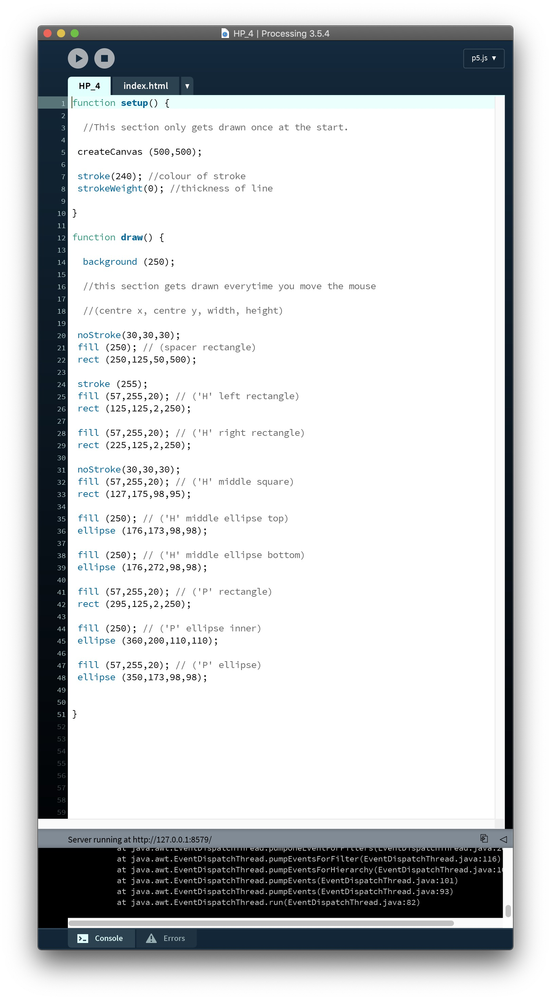

# Week 02

## Initials

this week we presented our initials that we designed and coded in processing.
It was really interesting to see how everyone had approached this, we all only had a very basic understanding of the program so were farily limited to what we had learnt in week one, this made it even more interesting to see what people had come up with using just basic shapes.
I found Processing fairly easy to understand as I had learnt HTML at the start of uni so I had a general idea of how coding worked, but i found p5js a lot easier than HTML, It just seemed to make more sense to me. After doing these HP experiments i'm really excited for the main project, I'm really keen to explore Processing further and see what's possible.

I've always enjoyed designing within a set of paramaters as it encourages me to think creatively so I think I'm really going to enjoy designing with code.

   a  |  b 
:-------------------------:|:-------------------------:
       |   
       |  

## Modular Typefaces

We also looked at modular typefaces this week.
I think modular typefaces and coding are very similar in the way that they both work within a set of limitations and follow a set of rules. A modular typeface must be made up from the same forms to concidered modular. I also like the way that most modular typefaces can by physically constructed and I imagine a lot of the time this is a part of the creative process of developing them as you could generate their physical forms and experiment with combinations to create the shapes.

*Some quick group research we did in class on modular typefaces and their designers*

The designer that I presented during our research session was [Benoit Bodhuin](https://www.instagram.com/benoitbodhuin/?hl=en), a type designer from France.
He is a designer I found a few months ago and really like his typefaces and design work, I chose to show his work in this exersice as some of his typefaces are modular (see below).

I like these two modular typefaces as it's not immediately obvious that they are modular. I was more intersted in the examples people showed of modular typefaces that took me a minute to work out how they were modular and what forms were being repeated.

   Pickle Typeface by Benoit Bodhuin  |  Standard Typeface by Benoit Bodhuin
:-------------------------:|:-------------------------:
       |   

## Github
This week we were introduced to Github, I had heard of Github before but had no idea what it was. Using Github to develop our SKO's seems like a really interesting way of forming a reflective piece of writing. I find it quite daunting writing large pieces of text, so breaking it up into folders and sections, using text and image to help explain and reflect on things will make the process a bit easier for me.

Github was quite intimidating at first, but like Proccessing after spending a bit of time playing around with it it started to make more sense. Having all of this work as public is quite intereseing as well, it will be helpful for us to be able to see each others work and also be able to edit each others code or borrow peoples markdown techniques. Normally when we do these kinds of reflections we probably wouldn't ever see each others work, but I think the ideas and realisations we have during the reflecction process can be more useful than the finished product.

In Stuart's studio at the beginning of the semester we were able to develop our SKO's in the form of a book, I really like these alternate ways of creating a reflection on our learnings compared to just writing a reflection as I think it gives us the opportunity to think about our work and our learnings in a different way

## Re-Readings

At the end of the day we figured out our groups for the re-readings assignment and chose the games we wanted to use. Originally I was keen on using Minecraft but it turned out a lot of other people were too, so in the end my group chose [Club Penguin](https://en.wikipedia.org/wiki/Club_Penguin). At first I was a bit dissapointed that I wasn't going to be able to play Minecraft, but after signing up and exploring the CP world I was again interested to see what sort of results we could come up with within the limitations of the game.
