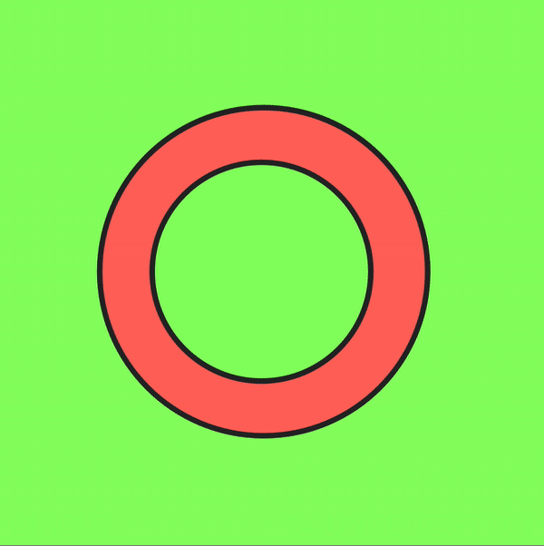
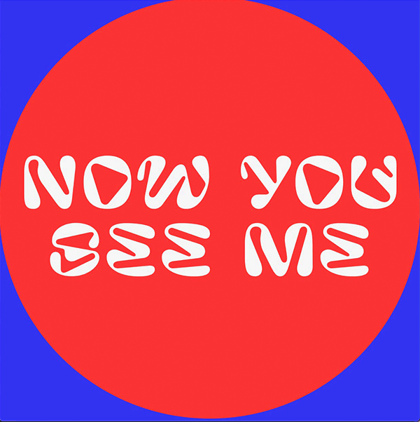

# Week 03

## Electronic Literature
At the start of this class we started looking at what electronic literature was and what it could be.
We split into groups again and did a quick research session finding different examples of electronic literature that fit into a few different catagories (see table). Some of these things I wouldn't have concidered electronic literature before, I think my general idea of what electronic literatyre was was a piece of long form text that was displayed in a digital format, but now i beleive that it is a much broader catagory and can really be anything that uses letters, words or text, written or spoken, in any type of digital format.

Having a stronger understanding of the meaning of electronic literature made me think a bit more about what I could do for my main project. I want to try and do something different to just presenting the text in written form on the screen, I need to research the possibilities of Processing to try and figure out some ways I can present my text in a unique way.

[A huge collection of electronic literature](https://collection.eliterature.org/3/keyword.html#javascript)

|   |   |    |
| ------------- | ------------- | ------------- | 
| CHATBOTS   |    |    |
| Eviebot  | Responds with the things that other users type into it  | https://www.eviebot.com/en/ |
| PonchoBottle  | A funny weather bot | https://chatbottle.co/bots/poncho-the-weathercat |
| PewdieBot  | A PewdiePie bot | https://www.pewdiebot.com/en/ |
| LIVE CODING PERFORMANCE | | |
| Ben Swift Live-coding music set  | A live coding musical performance  | https://www.abc.net.au/news/2019-07-21/ben-swift-performs-live-coding-set-in-canberra/11301592?nw=0 |
| Floating Points - Anasickmodular video   | Visuals from Floating Points' live show | https://www.youtube.com/watch?v=WezWspsKgpM |
| Daft Punk - Aerodynamic with Sonic Pi | Live performance of Aerodynamic by Daft Punk using Sonic Pi | https://www.youtube.com/watch?v=cydH_JAgSfg&feature=emb_logo|
| YH Chang   | generate sound by writing text: instead of adding tracks, instruments, samples. | https://www.yhchang.com/ |
| GENERATIVE TEXTS | | |
| Library of Bable   | Contains everything that could ever be written in 3200 characters | https://libraryofbabel.info/ |
| Grover   | State of the Art Neural Fake News Generator | https://grover.allenai.org |
| Bullshit Generator   | Generates Bullshit based on your topic entry | https://suulnnka.github.io/BullshitGenerator/index.html |
| Plot Generator   | Short story generator based upon your choice of style, character names, opening, adhectives | https://www.plot-generator.org.uk/story |
| This Word Does Not Exist   | AI generate endless of plausible babble that's inspired by dictionary words | https://www.thisworddoesnotexist.com/ |
| WORDS APPEAR/DISSAPEAR | | |
| Google Translater Camera   | Google AI translating words | https://venturebeat.com/2019/07/10/google-translates-camera-can-now-automatically-detect-languages/ |
| Story of the time when the Gods First Descended | Instalation that showed a graphic translation when touched by the audience | https://www.teamlab.art/w/gods1stdescended/ |
| Text Evolution   | Poem generator | http://www.textevolution.net/ |
| WORDS SPIN/ROTATE | | |
| Space Type Generator   | Interactive spinning word generator | https://spacetypegenerator.com/ |
| Donut Math   | Making a donut shape out of text | https://www.a1k0n.net/2011/07/20/donut-math.html |
| ANIMATED WORDS | | |
| Generative Design Project   | Changing simple variables in the code influenced the letterforms a different way each time the "sketch" was run. | https://www.behance.net/gallery/10436043/Generative-Design  |
| The Dreamlife of Letters   | Based on an appropriated text, Dreamlife is a work in which individual letters of the alphabet seem to take on their own distinct and lively characters. | https://www.youtube.com/watch?v=ZSnq0nMAQQc |
| Typograpphical Music Video   | Music video by Two Feet performing “I Feel Like I’m Drowning”.  | https://www.youtube.com/watch?time_continue=47&v=0HLIMp2rkFc&feature=emb_logo |
| GENERATIVE NOVELS | | |
| How To Rob a Bank | reinvention of Bonnie and Clyde for the digital age | https://webyarns.com/howto/howto.html |
| Novelling | algorithmically orders and spatially arranges fragments of media (design elements, text, video and sound) in 6-minute cycles. | http://novelling.newbinarypress.com/start.html |
| What if i'm the bad guy | “what if im the bad guy” is an experimental augmented reality based on the stories of three US soldiers in Afghanistan | https://webyarns.com/howto/howto.html |

## Processing
This week I continued experimenting with Processing outside of class and focused on making things appear and dissapear with mouse click.

a) This was fairly easy to figure out, I just had to figure out the distance the circle needed to travel so that it would change direction when the edge touched the outside of the 600x600 square. I also managed to create the effect of the circle dissapearing and the text appearing by placing rectangles filled with the background colour in front of them which appeared/dissapeared when the mouse was clicked.

b) After a lot of trial and error I figured out how I could make words 'change' when the mouse was clicked. Through trying to figure this out i realised how much creative coding is just problem solving. I had to think about this in a liteal way as if these words andshapes were real objects and try and figure out how i could hide/conceal them and make the others appear. My final solution was to have a rectangle appear over the top of 'now you see me' which would conceal the text, while this happens 'now you don't' is also made visable by the mouse click. This creates the effect of the words changing with the click of a mouse.

   a  |  b 
:-------------------------:|:-------------------------:
       |   

