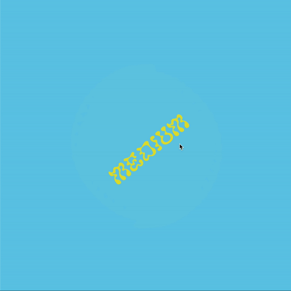
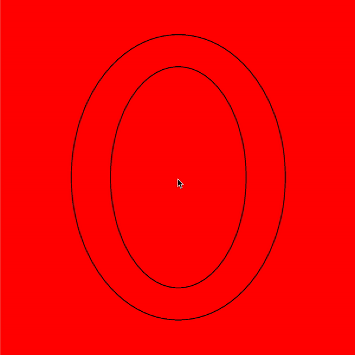
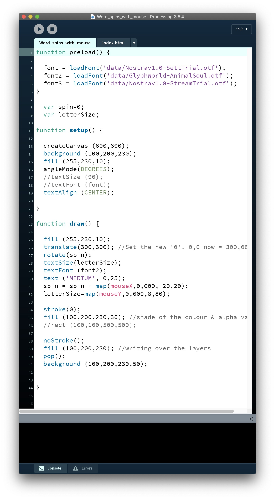
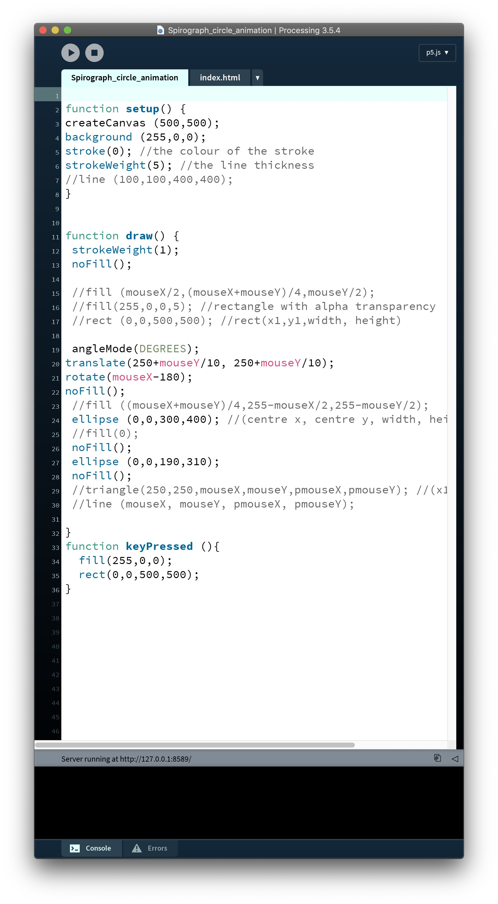

# Week 04

## Processing
Prior to this class I had done a little bit of experimenting with type inside of Processing, I figured out how to bring typefaces in and also how to enter long form text using a TXT file (below).

This got me thinking about ways I could use the text for the major project. I think it could be interesting to not use words at all and try using spoken word of presenting the text through audio in some way. I think if we are looking at this as a new way of 'reading' maybe the visual element can be entirely eliminated creating a new experience of reading altogether. I think it could be really interesting to push the traditional preconceptions of what it means to read something, Because we are working in a digital space we also have the ability to not limit the text to a single language or format.

*What is the opposite of reading?*  
*What is accessible reading?*  
*What does universal reading look like?*  
*What comes after the Kindle?*  

Most of the class this week revolved around coding. Karen introduced us working with words and typography in Processing.
We produced a spinning word that grew and shrunk with the mouse coordinates (a). The possibilities of interactivity with the type is something I am keen to explore further.
Karen also tought us how to make a [spirograph](https://en.wikipedia.org/wiki/Spirograph) that also changed speeds depending on the mouse position (b).
  
   a  |  b 
:-------------------------:|:-------------------------:
       |   
       |    
  
## Club Penguin

