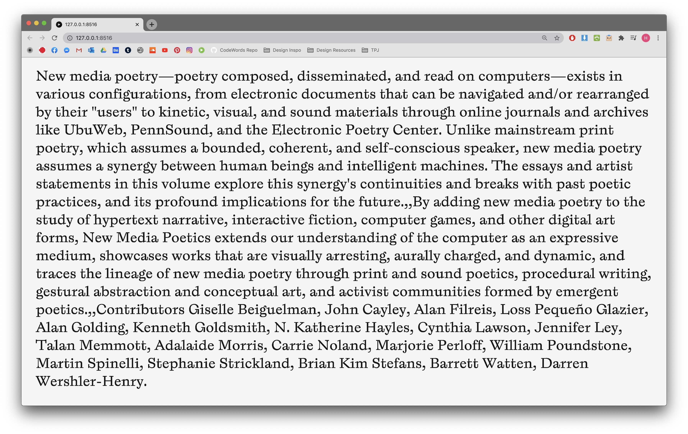

# Week 04

## Processing
Most of the class this week revolved around coding. Karen introduced us working with words and typography in Processing.
Prior to this class I had done a little bit of experimenting with type myself, I figured out how to use typefaces and also how to enter long form text using a TXT file (a).

