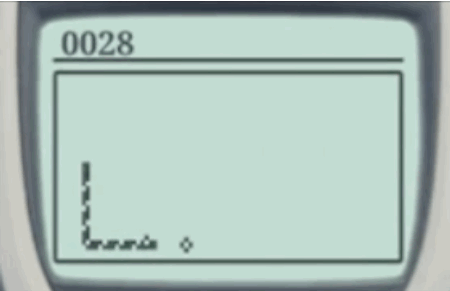

# Week 06

## Paper Prototypes
This week we started off by looking at paper prototypes. The main idea was that using paper to physically prototype a project it can help in communicating your ideas to someone else. If you just tell some your idea it can be a lot harder for them to actually picture it. We were tasked with creating paper prototypes for old video games, recreating the mechanics of the game using paper, as if you were going to show/explain it to someone who had never seen it before.

My group chose the old mobile phone game [Snake](https://www.google.com/search?q=Snake+game+mobile+phone&rlz=1C5CHFA_enAU851AU851&sxsrf=ALeKk03md9sSEIoSHLgE4zUOIIgTSUVCZw:1601192988852&source=lnms&tbm=isch&sa=X&ved=2ahUKEwiIr8Ta7IjsAhU4wjgGHYnWAnYQ_AUoAXoECBIQAw&biw=1465&bih=1135), this was a fairly easy task as the game mechanics are quite simple. Most of us had the same idea of showing the snakes as a series of single squares of paper that would join together to form a line which could then turn at 90 degree angles. [Bridie](https://github.com/bridieotoole/codewords) had a great idea of using longer strips of paper which had been cut not all the way across which created a type of hinge that allowed her to show the idea of the snake turning while keeping the piece of paper intact, I thought this was a creative solution to the problem.



## Processing
This week Karen walked us through how to make a sketch focusing on classes which made words appear on the screen wherever you clicked, the words would also jitter at a speed relating to the Y position of the mouse. The words that were displayed were chosen at random from a list we created at the beginning of the code.

View the sketch [HERE](https://hamishpayne.github.io/CODE-WORDS/Classroom/Week-06/WigglyLetters)

``` // 
// Base sketch by Karen Ann Donnachie 
// a sketch to learn about "class" construction and also some wiggly letters
// 17 September
var xPosition, yPosition, size, rand, letter, speed;
var letterCount=0;
//var longtext;
var sentence = ["Goodbye", "Code", "+","Words", "Have", "Fun!"];
var wigglyLetters = [];
function preload () {
  // load up your text to longtext
  // split text to words (by space) 
  // assign to sentence[]
}
function setup() {
  createCanvas(windowWidth,windowHeight);
  background (0);
  textSize(32);
  fill(255);
  textFont("Times");
  xPosition = 100;
  yPosition = 100;
}
function draw() {
  background(0);
 // background(0, 5); will make a fade effect (comment out previous line)
 fill(255);
 //text(frameCount,mouseX,mouseY);
 for (var i=0; i<wigglyLetters.length; i++){
  wigglyLetters[i].wiggle();
  wigglyLetters[i].display();
 }
}
function mousePressed(){
  size = int(random(6,100));
  //letter = char(int(random(60,160)));
  letter = sentence[letterCount];
  wigglyLetters.push(new Wiggle (mouseX, mouseY, size, letter));
  if (letterCount<sentence.length){
  letterCount++;
 } else {
 letterCount =0; 
 }
}
function keyTyped() {
  wigglyLetters.push (new Wiggle (xPosition, yPosition, 54, key));
  xPosition += 54;
}
class Wiggle {  
  constructor (x, y, size, letter) {
    this.x = x;
    this.y = y;
    this.textSize = size;
    this.letter = letter;
  }
  wiggle() {
    //this.x += random (-2,2);
    //this.y += random (-2,2);
    speed = map(mouseY, 0, windowHeight, 0,10);
    this.x += random (-speed, speed);
    this.y += random (-speed, speed);
  }
  display() {
    //ellipse (this.x, this.y, this.textSize, this.textSize);
    textSize(this.textSize);
    text(this.letter, this.x, this.y);
  }
}
```

## Major Project
After deciding which text I was going to use last week I chose which section I was going to use for the major project. The text spoke about a few different artists and projects which were all relating to the ideas of physical bodies in a digital utopia, but I found that the introduction paragraph to the section on [Floating Point Unit](https://floating.pt/), a group of New York-based artists, summed up the ideas from the whole text nicely (see below). This section also stood out to me due to it's visually descriptive terms and ideas which I thought would translate well into the project.

#### In the age of new eugenic consciousness, physical bodies are cumbersome: their opacity is opposed to the transparence of the digital utopia that promotes a distance from experienced reality and a uniform space and time. The body and physical ex- periences are disruptive, because physical functions are both unpredictable and difficult to quantify. Within the digital economy, desire is given a privileged place, be- cause it can be rerouted into consumerism. Body politics, then need to be orches- trated within this frame of organized consumption and fabrication: fit bodies, perfect health, eugenic ideology and neo-natal procedures organize the comprehension and use of the body within specific parameters.

[PREV](https://github.com/HamishPayne/CODE-WORDS/edit/master/Classroom/Week-05).[NEXT](https://github.com/HamishPayne/CODE-WORDS/edit/master/Classroom/Week-07)
