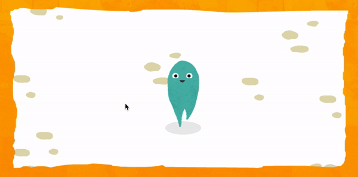
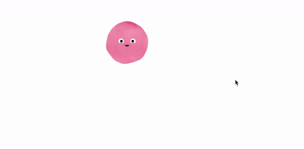

# Week 07

## Paper Prototypes
We started off the session this week by putting the chosen section of our text into [google doc](https://docs.google.com/spreadsheets/d/1rqOlmfpCzXC9kA_vBeLOcTpdxCvWeo4zsiNa4uiDHTY/edit#gid=0). Then, in small groups, we presented our paper prototypes we had made during the week for our projects. It was really good to hear Celia and Win's ideas for their projects and see their paper prototypes. Showing them mine and speaking them through my idea helped me to get a better understanding of what I actually wanted to do, they also gave me some really helpful feedback. Win also showed me a few websites which he thought could help me with my idea.

[Whispering Galleries](https://www.whisperinggalleries.com/)\
"Whispering Galleries is an interactive artwork developed specifically for the city of New Haven by Brad Bouse and Amaranth Borsuk, the creators of Between Page and Screen, a book of augmented reality poems."\
The design of Whiespering Galleries is very similar to what I want to do with my project, using type/transparency and audio input to effect text on the screen. I will try and do some further research into this project to see if i can find some motion visuals of it in action. The project explore themes of the intersection of phsycial and digital which is exactly what i'm looking at doing.

[Phase](https://www.eliashanzer.com/phase/)\
Win also showed my Phase font by [Elias Hanzer](https://www.eliashanzer.com/) which I had actually known about before, but he remindede me that it has an audio input option which lets you play with the aspects of the font through the audio input on the computer which is another idea i'm interesting in using for the project, I'm going to see if I can inspect the code that the site uses to figure out how it's done. Thanks Win!

## p5js
In the afternoon Karen showed us a few different resources for p5js and showed us some cool examples of using sprites (a,b), I remember using sprites when using [Game Maker](https://www.yoyogames.com/gamemaker) when i was in grade 3.

[p5js libraries](https://p5js.org/libraries/)\
-An overview of p5js libraries\
[p5.play](http://molleindustria.github.io/p5.play/)\
-A p5js library used for creating games 'playthings'.

   a  |  b 
:-------------------------:|:-------------------------:
       |   

## RMIT cuts
Karen told us about the staff cuts that are currently happening at RMIT which I had no idea about, she used psuedocode to express her feelings toward the situation. 
(WRITE MORE ABOUT THIS)(WHAT WILL PROTESTS LOOK LIKE IN THE FUTURE)


```
Karen's Code
#include <australianUniversities.h>
#include <HEstaff.h>
#include <NTEU.h>
#include <students.h> 

void fightTheCuts() {
  while (cuts > 0) {
    resist ();
    print (“Fight The Cuts!”);
    protest++; 
    discuss();
  }
  print (“university belongs to all Australians”);
} 
``` 
(Taken from [Bridie Toole's Github](https://github.com/bridieotoole/codewords/blob/master/week_07/readme.md))


## Inspo
Andy shared with us [a collection](https://github.com/HamishPayne/codewords-3/tree/master/Case_studies) of different portfolio's and websites that had interesting coding, [one of the websites](http://matterofsorts.com/) featured a blur effect on the work which became clear once you hovered over it with the mouse. I'm wanting to do something quite similar to this for my project so I plan on inspecting the code to see how they've achieved this.


