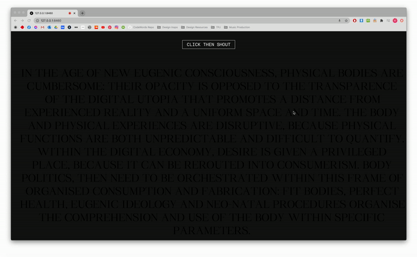
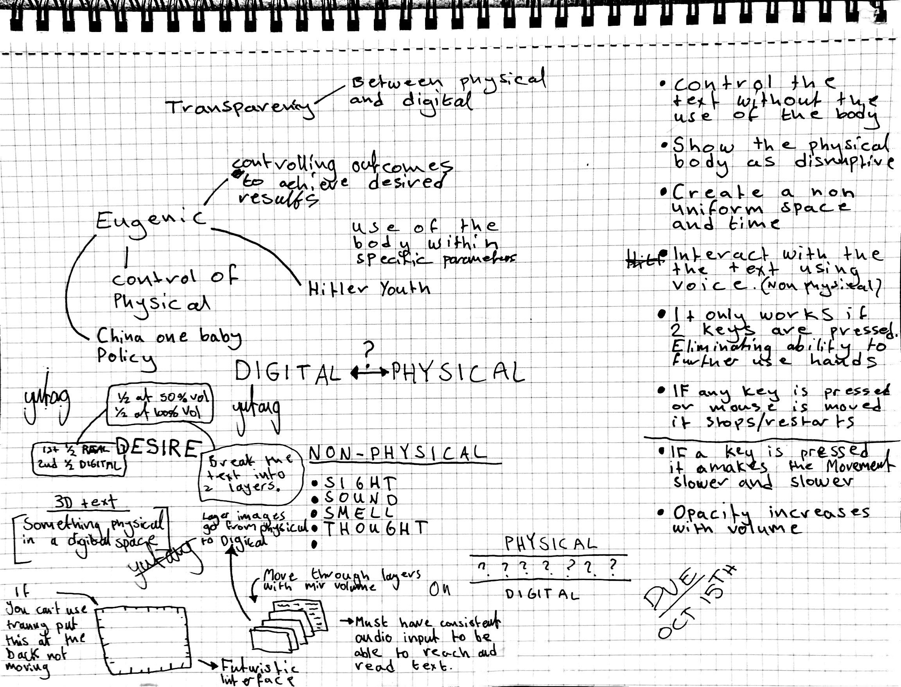

# Week 08


## Processing
Karen spoke about checkpoints in a project, reaching each checkpoint in the stages of a project and working through it stage by stage. It's better than just seeing the end as the only checkpoint and it also gives you a fallback in case you are struggling to complete something you can just revert back to your last checkpoint. Karen also mentioned that we are not archers, we are not aiming to shoot our arrow and hit the bullseye, meaning there is not 1 specific goal we should be aiming for but instead be open to what we discover during the process and adjust our final goal as we work (I think that's what she meant).

## Processing
This week Karen walked us through how to make a sketch focusing on classes which made words appear on the screen wherever you clicked, the words would also jitter at a speed relating to the Y position of the mouse. The words that were displayed were chosen at random from a list we created at the beginning of the code.

*View the sketch [HERE](https://hamishpayne.github.io/CODE-WORDS/Classroom/Week-06/WigglyLetters)*

``` // 
// Base sketch by Karen Ann Donnachie 
// a sketch to learn about "class" construction and also some wiggly letters
// 17 September
var xPosition, yPosition, size, rand, letter, speed;
var letterCount=0;
//var longtext;
var sentence = ["Goodbye", "Code", "+","Words", "Have", "Fun!"];
var wigglyLetters = [];
function preload () {
  // load up your text to longtext
  // split text to words (by space) 
  // assign to sentence[]
}
function setup() {
  createCanvas(windowWidth,windowHeight);
  background (0);
  textSize(32);
  fill(255);
  textFont("Times");
  xPosition = 100;
  yPosition = 100;
}
function draw() {
  background(0);
 // background(0, 5); will make a fade effect (comment out previous line)
 fill(255);
 //text(frameCount,mouseX,mouseY);
 for (var i=0; i<wigglyLetters.length; i++){
  wigglyLetters[i].wiggle();
  wigglyLetters[i].display();
 }
}
function mousePressed(){
  size = int(random(6,100));
  //letter = char(int(random(60,160)));
  letter = sentence[letterCount];
  wigglyLetters.push(new Wiggle (mouseX, mouseY, size, letter));
  if (letterCount<sentence.length){
  letterCount++;
 } else {
 letterCount =0; 
 }
}
function keyTyped() {
  wigglyLetters.push (new Wiggle (xPosition, yPosition, 54, key));
  xPosition += 54;
}
class Wiggle {  
  constructor (x, y, size, letter) {
    this.x = x;
    this.y = y;
    this.textSize = size;
    this.letter = letter;
  }
  wiggle() {
    //this.x += random (-2,2);
    //this.y += random (-2,2);
    speed = map(mouseY, 0, windowHeight, 0,10);
    this.x += random (-speed, speed);
    this.y += random (-speed, speed);
  }
  display() {
    //ellipse (this.x, this.y, this.textSize, this.textSize);
    textSize(this.textSize);
    text(this.letter, this.x, this.y);
  }
}
```

## MAJOR PROJECT
This week I started to build the sketch for my main project. Following a Coding Train tutorial I was able to incorperate the microphone input. I made the mic input effect the colour of the text so that it appeared to dissapear when you made noise. It was good to figure out how the mic input worked but I will need to keep working on this to figure out how to actually make the text appear and dissapear and not just change the colour of it. The idea is to force the user to interact in a non physical way, one of the ideas from my chosen section of text is the way that physical bodies become disruptive in a totally digital existance so I want to try and have that as the basis of the project.



*View the sketch [HERE](https://hamishpayne.github.io/CODE-WORDS/Classroom/Week-08/text_reacts_to_mic__cleanup_)*

This week I continued to brainstorm different ideas for the sketch and different ways I could visualise themes from the sketch.
The main things I want to show are:

*Control over the text without the use of the body*\
*Show the physical body as disruptive*\
*Create a non-uniform space and time*\
*Interact with the text using voice/sound*\
*If any key is pressed the sketch stops/restarts*\
*Opacity increases with volume level*\



[PREV](https://github.com/HamishPayne/CODE-WORDS/edit/master/Classroom/Week-07).[NEXT](https://github.com/HamishPayne/CODE-WORDS/edit/master/Classroom/Week-09)
