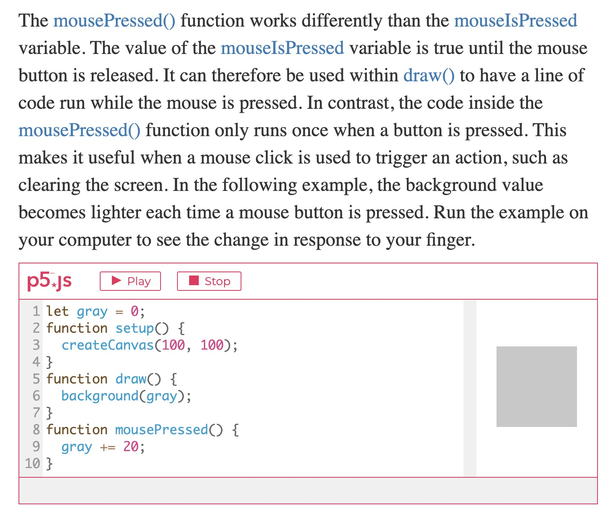

# Week 09 (Missed Class)

## Main Project

[My main project so far](https://hamishpayne.github.io/CODE-WORDS/Classroom/Week-09/text_reacts_to_mic).
-Talk about main project so far. Ideas, problems etc.

[Laggy Blur](https://hamishpayne.github.io/CODE-WORDS/Classroom/Week-09/text_blur)
Laggy blur being effected by mouseX is extremely laggy to the point of the chrome window being unresponsive, need to troubleshoot.\
*Maybe filters are too complex to be used in this way*\
*How else could I do this?*

[This](https://p5js.org/learn/interactivity.html) is a great example that shows a grey square gradually changing colours each time it is clicked. I want to use something like this to communicate the idea of the physical body being interuptive. If the user presses any key on the keyboard or mouse the sketch will slowly start to dissapear or become disrupted in some way.

[PREV](https://github.com/HamishPayne/CODE-WORDS/edit/master/Classroom/Week-08).[NEXT](https://github.com/HamishPayne/CODE-WORDS/edit/master/Classroom/Week-10)
