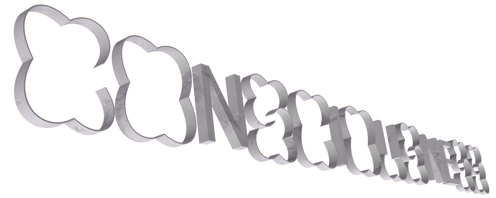

# Week 10

## FONTS + FACES
This week in class we spoke a bit about typeopgraphy and Andy reminded us that our major projects should have a typographic focus, he was saying it's easy to get caught up in the coding side of it but the assignment and studio are meant to have a focus on typography. Andy and Karen introduced us to Google Noto Fonts and Font Forge.

### [Google Noto Fonts](https://www.google.com/get/noto/)
Google Noto Fonts is a font family being developed by Google which aims to support all languages, "Noto is Google's answer to tofu. The name noto is to convey the idea that Google's goal is to see no more tofu".

### [Font Forge](https://fontforge.org/en-US/)
Font Forge is a free open source font editor. Andy and Karen have mentioned a few times this semester how they think it's important for students to produce their own typefaces. They have said they beleive it's important for students and designers to be able to produce a project that they have produced entirely themselves from start to finish including the production of a typeface to the final printing. This is something I've always wanted to have a go at and I think I will experiment with this summer.

Andy reminded us of the list of examples made by Karen that were available to us and stressed the importance of referencing any code that you borrow or take from someone elses work.

https://github.com/Simandy/codewords/blob/master/processing/examples.md
https://github.com/Simandy/codewords/tree/master/processing

## MAIN PROJECT

### Inspiration

Insane pixel garden website
http://www.pointcloud.garden/

Using a 3d object in p5js (face model with text running over)
https://www.openprocessing.org/sketch/872535

3D text in P5JS, camera movable with mouse. 3D space.
https://www.openprocessing.org/sketch/913474

### PHASE

Following last weeks class I wanted to find a typeface for my project. After being reminded by Win about the [Phase typeface](https://www.eliashanzer.com/phase/) I did some more experimenting with it's possible variations and decided it would be perfect for the project. The font can be edited online and downloaded as whatever varient you come up with as a full set of glyphs. One of the possible outcomes is a font which combines different stroke weights within some of the letterforms, I think this is a really nice way of visualising the idea of a transition from physical to digital.


### Three dimensions
In my text Catherine Bernard speaks about Guy Debord's *The Society of the Spectacle*, a book written in 1967 that examines the 'specticle', "Debord's term for the everyday manifestation of capitalist-driven phenomena; advertising, television, film and celebrity". Debord's text speaks about a future society where all life presents itself as an accumulation of spectacles, everything is a representation. I thought it would be interesting to try and link the ideas in this text into my project as it seemed to strongly influence Catherine Bernard's text.

My idea is to produce the text in my sketch in 3D, drawing on the idea that in a digital utopia even writing and words have become some sort of representation, the words have become 'physical' objects, representations of words. Another idea I had was to use symbols instead of letters to tie into the idea of commodity fetishism which Debord speaks about, but I think that might detract from the reading experience.



### The Code
Over the week I continued to develop the code and worked on adding in the 3D text. I figured out how to make the text's transparency go down with the users mic input by mapping it to the alpha of the image, alpha is basically opacity in p5js. 

``` // 
  let vol = mic.getLevel()*40;
  let h = map(vol, 0, 1, 0, 75);
  
  translate(windowWidth/2,windowHeight/2);
  tint(255, h);
  image(fulltext,0,pos,width/2, fulltext.height*width/fulltext.width/2);
```
I made the different layers of images scroll at different speeds by mapping them to a mouseWheel event and then dividing the number to slow down the movement. The maths is getting a bit intense with these so I may need to clean this up a bit for the final sketch, but it seems to be working well.

``` // 
  image(rock,windowWidth/6+h*5,pos*3+windowWidth/6,1557/4,1139/4);
  image(cloud,windowWidth/4,pos/2-250,3480/3,1336/3);
  image(cloud,-windowWidth/4,pos/3+300,3480/3,1336/3);
```
``` // 
  function mouseWheel(event) {
  print(event.delta);
  pos += event.delta;
```


### notes

- Show the final layer as a utopia
- ‘Distance from experienced reality’
- The layered images go from physical space to digital space
- Try and use 3d (cinema4d) to show physical text (physical materials) existing in a digital space
- Could have multiple images that display randomly each time you refresh, each time it’s a different experience
- What represents the physical? What represents the Digital?

- Show some of the inspo from notes. Only the stuff that's relevent    
- Andy reminded us that this was a typography class and that we should be focusing on the typographic aspect of this project so i looked really hard for a typeface that would fit the themes of the text. PHASE
- Show my 'notes for my project'   
- 3D text (look at notes for why)
- Speak aobut the physicallity of the images (rock, 3d text and it's natural texture)
- SHOW CODE (go back and add in code for prev weeks)


[FINAL v5](https://hamishpayne.github.io/CODE-WORDS/Classroom/Week-10/FINAL_v5)  

[PREV](https://github.com/HamishPayne/CODE-WORDS/edit/master/Classroom/Week-09).[NEXT](https://github.com/HamishPayne/CODE-WORDS/edit/master/Classroom/Week-11)
