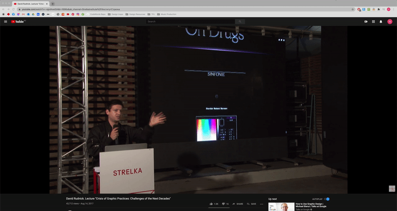

# Week 11

## CLASSROOM
During class this week Andy and Karen shared with us a document they had made which would help us to talk about our work and come up with our written statements. This is something I've always struggled with so working through it step by step was really helpful, I will hang onto this document to use again in the future.

https://docs.google.com/document/d/10JPVNuT5CizS7II0iEubLLbWQZ6S0t9YxBRqc5ZhSfU/edit

- *Make sure it’s based around the text, that’s what the project is bout.* 
- *Don’t just waffle for the sake of it, be honest and speak about what you really did and thought. Don’t be superficial.*   

Andy spoke to us about what we were going to do with the website where we would all display our work at the end of the studio, he showed us some examples of similar sites that him and Karen had produced in the past

[RMIT grad show](http://rmitcd.grad.show/list.php) \
[Wot is a book](http://wotisabook.com/) \
[AR u ready](http://www.digbeyond.com/ARuready/index.php)

## MAJOR PROJECT
In class we all shared our work in progress and got feedback from Andy.

Andy’s Feedback: 2:00:00 PM ––– amazing aesthetic. dreamy reading space... and perfect font. digital utopia that explores digital materiality. loss of physical body (use of mic). take care of scrolling... what about floating the rock so that it returns into view...   

Some questions i'm asking myself this week     
- *How can I make it smoother, whole numbers for the tint?*
- *How can I limit the mouse scroll?*  
- *Would it be possible to have a different font each time? Random out of 10.*  
- *Take advantage of the phase font.*   
- *Do you think I’m leaving out too much from the text? Eugenics, body politics etc?*  
- *How to make the words slowly scroll with mic input? Only moves really slow.*   
- *How can I make the rocks slow/stop with mic input?*  
- *I’m trying to think of a work around for using mouse scroll, it’s too physical.*    
- *Wrote out my 200 word reflection ready for the final submission*

Over the past week I worked on getting the text to scroll with the mic input. I felt using the mouse scroll was too much of a physical interaction, I wanted all interaction to be done through the mic. I also decided that having the alpha (opacity) of the text being effected by the mic input made it too difficult to read.

Using the same code that I used to effect the alpha of the text i mapped it to effect the position on the Y axis making it scroll. I will need to do some more testing to figure out what a good speed is for the text to scroll.

``` // 
  let vol = mic.getLevel()*40;
  let h = map(vol*5, 0, 1, 0, 75);
  
  p = (fulltext.height*width/fulltext.width);
  
  image(fulltext, 0, k+windowHeight/20, width, p);
  k = k - h/2000;
``` 
After sending the sketch to a friend they said they found it hard to read with the text at that size, the line length was too short. Over the next week I will work on the readability of the text and ensure that it reads nicely as a long piece of text and not just as words. I think having it in 3D makes it seem more like an image, but I want to ensure that it is still a reading experience.

I've also introduced some more 'physical' objects into the foreground, focusing on natural objects to communicate the idea of a physical world. These are mapped the same way as the text to move to the outside of the sketch when the user makes noise, clearing the way for the text to be read. Over the next week I will work on the imagery and design of the digital utopia in the background of the sketch.

Something I also need to work on is what instructions I will have on the opening screen of the sketch. I need the user to know to use the mic input and that physical interaction is disruptive without it being overly instructional.


## DAVID RUDNICK
This week I stumbled upon a great lecture that [David Rudnick](https://davidrudnick.org/) did in 2017, I've always loved his work but never heard him speak about it. I found it really interesting the way he spoke about the future of graphic design and the comparison he made to fine dining. Talking about how fine dining institutes are an example of what graphic design should be. A restaurant can’t exist on the internet, they must consider space, physically, smell and sound as these all have an effect on the final product of the restaurant experience. Graphic design today largely exists only on the internet and he thinks there needs to be a shift from this way of working, with more attention given to the other senses and aspects of humans ineraction with design. "What kind of narrative can you produce with something that only exists on the internet".

He compared designers to chefs, chefs do research trips, experimentation with food and ingredients, research and development and spend years developing their skills . They must be doing something special and new to be succesful at a high level. Imagine if designers worked on that level, everything we produce had to be a revelation and also meaningful and relevent to us and our practice.



*Watch the lecture [HERE](https://www.youtube.com/watch?v=-ejp4AvetSA&ab_channel=StrelkaInstitute%2F%D0%98%D0%BD%D1%81%D1%82%D0%B8%D1%82%D1%83%D1%82%D0%A1%D1%82%D1%80%D0%B5%D0%BB%D0%BA%D0%B0)*


[PREV](https://github.com/HamishPayne/CODE-WORDS/edit/master/Classroom/Week-10).[NEXT](https://github.com/HamishPayne/CODE-WORDS/edit/master/Classroom/Week-12)
