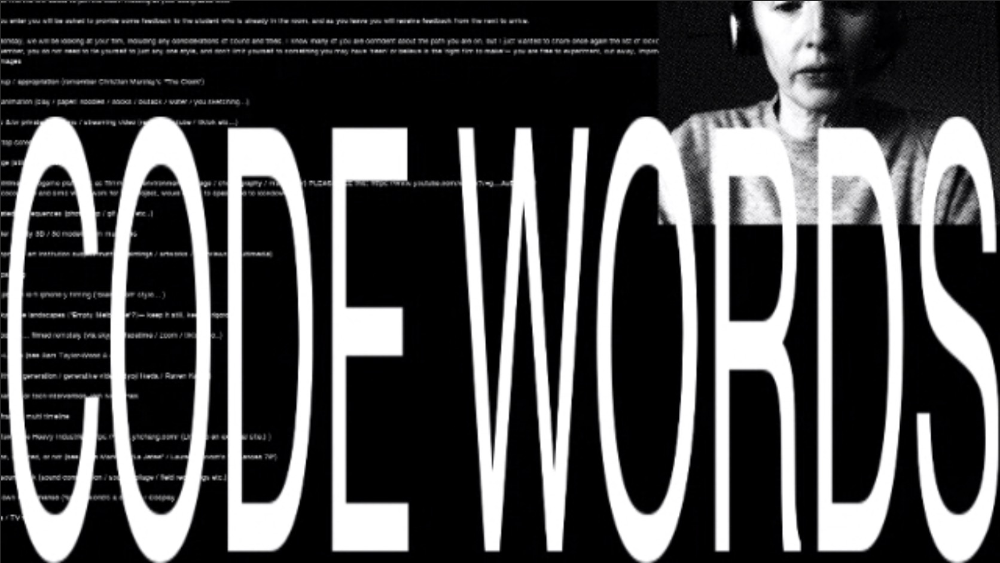

# WEEK 12



## CLASSROOM
In class this week we all worked on filling out the submission form which had information for the website including our written statement. We also produced GIF's of our work for the website which was a lot harder than I thought it would be... Keeping them under 1MB was not easy. We also briefly presented our work to the class, it was awesome to see everyone's finished sketches and hear them speak about their process and final product.

While we were presenting our work Karen (incredibely quickly) worked on finishing the website which was live by the end of the class.

## MAJOR PROJECT
This week I worked in finishing my sketch before our final class. I added in the background imagery and tweaked the movement of the objects to ensure the text scrolled at a good speed for reading. I added a particle class which created small floating dots to the background to further communicate the idea of it being a digital utopia, I feel that they give a sense of endless space and a dream like look and feel. I used a pixelated gradient for the background to further communicate the sense of a digital space in contrast to the natural objects in the foreground.

``` // 
class Particle {
  constructor(){
    this.x = random(0,width);
    this.y = random(0,height);
    this.r = random(1,3);
    this.xSpeed = random(-1,1);
    this.ySpeed = random(-1,1);
  }
  createParticle() {
    noStroke();
    fill(255,255,255,100);
    circle(this.x,this.y,this.r);
  }
  moveParticle() {
    if(this.x < 0 || this.x > width)
      this.xSpeed*=-1;
    if(this.y < 0 || this.y > height)
      this.ySpeed*=-1;
    this.x+=this.xSpeed;
    this.y+=this.ySpeed;
  }

  joinParticles(particles) {
    particles.forEach(element =>{
      let dis = dist(this.x,this.y,element.x,element.y);
      if(dis<85) {

      }
    });
  }
}
``` 

I also added some code which drew the rocks and different positions on the screen each time the sketch was opened by assigning a random value to a letter which I used for the X and Y positioning of the rock images.
``` // 
b = random(0,width);
e = random(0,height);

image(rock,b+h, e+h, width/5, rock.height*width/rock.width/5);
``` 

Finally, I incorperated the background portion of the sketch to dissapear when a key is pressed on the keyboard using the keyPressed function, forcing the user to refresh the page to be able to read the text again. This represents the idea of physical bodies being disruptive and cumbersome in a digital utopia. 
``` // 
  fill (250,value);
  rect (0,0,windowWidth,windowHeight);

function keyPressed() {
  if (tran === 0) {
    tran = 255;
  } else {
    tran = 255;
  }
}
``` 


#### ARTIST STATEMENT
NEOTOPIA invites the reader to consider a non-physical existence through an online interactive reading interface. Drawing on themes of digital physicality and the human body from Catherine Bernard’s ‘Bodies and Digital Utopia.’ NEOTOPIA visualises the inevitable complete transition from physical to digital, using the text as a way to discuss the physical and social repercussions of said transition. Playing on the expected interactive techniques of a web browser interface, NEOTOPIA introduces a new way of reading.
In this new interface, all physical interactions are now disruptive to the reading experience. Any key pressed causes the digital SECTION of the interface to disappear. To activate the transitional state of the interface the user must vocally interact in some way, causing the physical objects to temporarily transition and fluctuate with the audio input levels clearing the way for the text. As well as making the text visible, the readers audio input scrolls the text, once again forcing the user to consider a non-physical way of interacting and reading.
The text is set in Phase, a generative modular type concept created by Elias Hanzer. Connecting thicker, rigid forms with more organic, curved structures these letters come together to form a font which itself exists in a state of transition.

*You can view my final projects code [HERE](https://github.com/HamishPayne/CODE-WORDS/blob/master/Processing/NEOTOPIA/NEOTOPIA.js)*\
*You can view my final project [HERE](https://hamishpayne.github.io/CODE-WORDS/Processing/NEOTOPIA/)*\
*You can view the website showcasing all of our final projects [HERE](http://digbeyond.com/codeWords/list.php)*

## REFLECTION
This studio has been awesome and a really great way to finish my studies. I've really enjoyed learning the processes involved in creative coding and it has given me a different way of approaching my design work as a whole. Andy and Karen have been awesome teachers for this final semester, their approaches and views on design and education have been really important and eye opening for me. I aim to keep experimenting with creative coding in the future and see how I can integrate it into my practice.

Massive thanks to Andy and Karen for helping us all this semester, it's been a really great experience and one I will never forget!

[PREV](https://hamishpayne.github.io/CODE-WORDS/Classroom/Week-11/).[HOME](https://hamishpayne.github.io/CODE-WORDS/)
