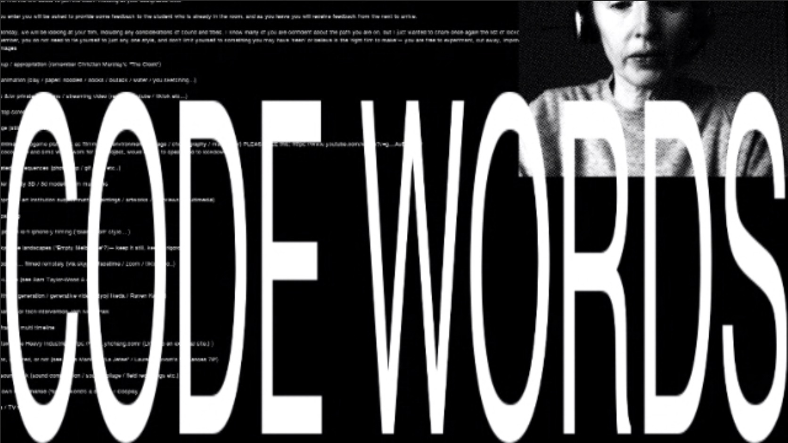

[Week 01](https://hamishpayne.github.io/CODE-WORDS/Classroom/Week-01/)\
[Week 02](https://hamishpayne.github.io/CODE-WORDS/Classroom/Week-02/)\
[Week 03](https://hamishpayne.github.io/CODE-WORDS/Classroom/Week-03/)\
[Week 04](https://hamishpayne.github.io/CODE-WORDS/Classroom/Week-04/)\
[Week 05](https://hamishpayne.github.io/CODE-WORDS/Classroom/Week-05/)\
[Week 06](https://hamishpayne.github.io/CODE-WORDS/Classroom/Week-06/)\
[Week 07](https://hamishpayne.github.io/CODE-WORDS/Classroom/Week-07/)\
[Week 08](https://hamishpayne.github.io/CODE-WORDS/Classroom/Week-08/)\
[Week 09](https://hamishpayne.github.io/CODE-WORDS/Classroom/Week-09/)\
[Week 10](https://hamishpayne.github.io/CODE-WORDS/Classroom/Week-10/)\
[Week 11](https://hamishpayne.github.io/CODE-WORDS/Classroom/Week-11/)\
[Week 12](https://hamishpayne.github.io/CODE-WORDS/Classroom/Week-12/)
